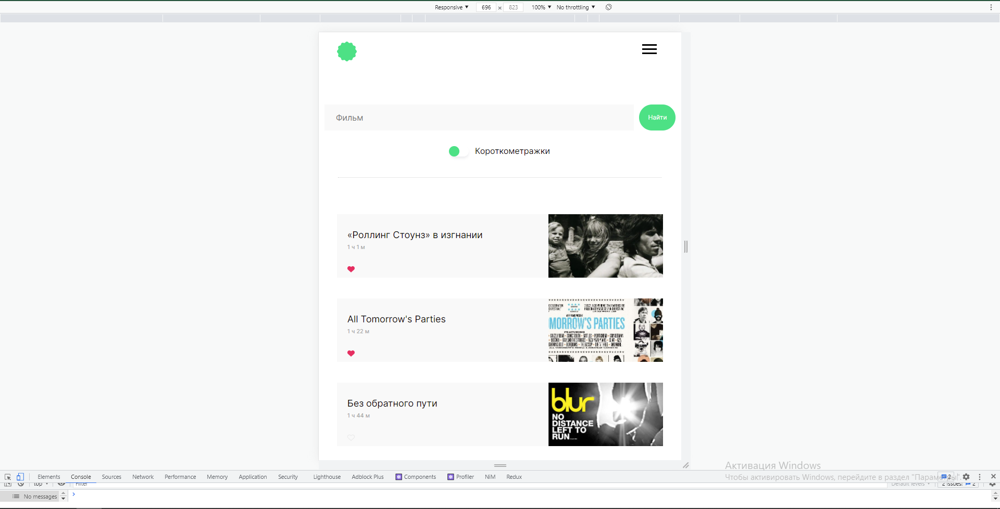

# Фронт-енд часть проекта Movies-explorer.
----
## Описание проекта  

Данный проект является учебным агрегатором поиска фильмов. Во фронтенд части реализованы следующие возможности:  
* Подтягивание списка фильмов со стороннего API и сохранение их в localStorage.
* Фильтрация фильмов по ключевым словам с последующей возможностью их сохранения.
* Фильтрация фильмов по их длительности(короткометражки или обычные).
* Валидация данных при редактировании профиля.

Собственная серверная часть позволяет проводить регистрацию, вход, сохранение фильмов и т.д.  
Подробное описание серверной части можно найти тут: https://github.com/Shyou92/movies-explorer-api  

Стек технологий:  
* HTML5
* CSS3
* JS
* React.js
* Git

Скриншоты проекта:

Главная страница (HelloWorld):

О Проекте:

Технологии:

О студенте:

Регистрация:

Регистрация, ошибки:

Главная страница (фильмотека):

Список фильмов:

Список короткометражек:

Сохранённые фильмы (пустой):

Добавление в сохренённые фильмы:

Сохранённые фильмы (с фильмами):

Список фильмов (адаптив):

Бургер меню (адаптив): 

